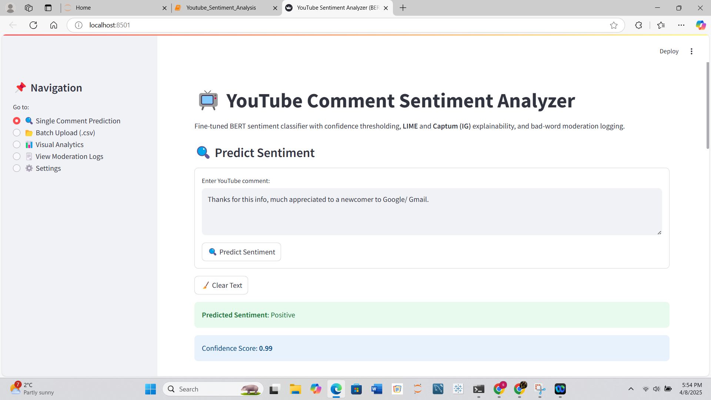
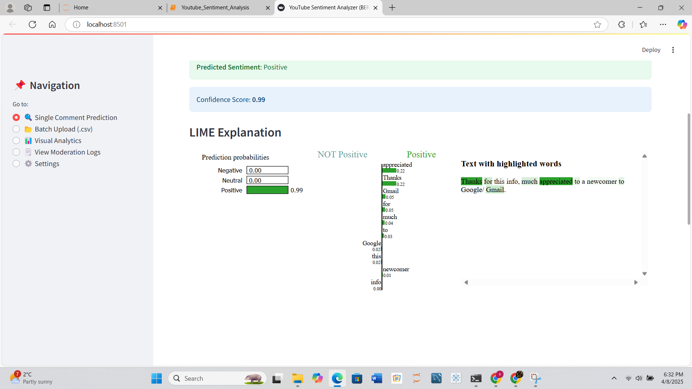
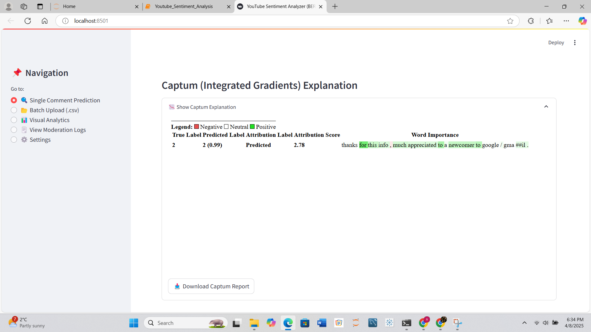

# YouTube Comment Sentiment Analyzer 

A production-grade, explainable NLP system built to classify YouTube comments into **Positive**, **Neutral**, or **Negative** sentiments using a fine-tuned BERT model. Features include **LIME**, **Captum (Integrated Gradients)**, and a **moderation layer**. Deployed via **Streamlit Cloud** and Docker for scalable public access.

🔗 **Live App**: [https://youtube--sentiment--analyzer.streamlit.app](https://youtube--sentiment--analyzer.streamlit.app)

---

## Project Overview

This project bridges real-world sentiment analysis with explainability and responsible AI. It analyzes YouTube comments fetched using the Google Cloud YouTube Data API and presents predictions with explainability visualizations, moderation logging, and confidence control.

---

## 📂Project Structure

YouTubeSentimentProject
  ─ app.py                       
  ─ sentiment_utils.py          
  ─ model
    ─ fine_tuned_bert        
  ─ assets
     ─ logo.png                
  ─ data
    ─ Final
        ── bad_words.txt
        ── bad_words_regex.txt
        ── confidence_analysis.csv
 ── logs
    └── flagged_comments_log.csv
── notebooks
   └── Youtube_Sentiment_Analysis.ipynb
── Dockerfile                  
── requirements.txt
── .gitignore
── README.md

---

## Features

- Fine-tuned BERT (`bert-base-uncased`)
- English → French → English backtranslation for class balancing
- LIME & Captum explainability integration
- SHAP (for benchmarking with XGBoost)
- Rule-based moderation system (keyword + regex)
- Real-time Streamlit dashboard with:
  - Single + Batch prediction
  - Confidence thresholding
  - LIME + Captum download options
- Flagged comment logging with timestamps
- Docker and Streamlit Cloud deployment

---

## Demo Screenshots
| Single Prediction | LIME Explanation | Captum IG |
|-------------------|------------------|-----------|
|  |  |  |

---

## Data Collection

- Extracted using **YouTube Data API v3**
- 10 public videos across genres: Education, Music, News, Public Policy
- 1500–2000 total comments fetched
- Preprocessing includes:
  - Lowercasing
  - URL/emoji/punctuation removal
  - Regex cleaning
  - English-only filtering

---

## ⚖️ Class Imbalance Handling

| Technique           | Performance         |
|---------------------|---------------------|
| Raw (Imbalanced)    | Biased results    |
| Class Weights       | Minor improvement |
| SMOTE Oversampling  | Moderate boost    |
| **Backtranslation** | Best performance (final choice) |

---

## Model Architecture

| Model                      | Accuracy | F1-Score |
|---------------------------|----------|----------|
| Logistic Regression (TF-IDF) | 0.71     | 0.68     |
| XGBoost (TF-IDF)          | 0.74     | 0.71     |
| BERT + PCA + XGBoost      | 0.81     | 0.79     |
| **Fine-tuned BERT**       | **0.88** | **0.88** |

- Tokenizer: `bert-base-uncased`
- Max Length: 256
- Optimizer: AdamW (`lr=2e-5`)
- Epochs: 4
- Evaluation: Accuracy, Precision, Recall, F1

---

## Explainability

- **SHAP**: For benchmarking insights (XGBoost + BERT embeddings)
- **LIME**: Token-level HTML visual explanations for BERT predictions
- **Captum (Integrated Gradients)**: Gradient-based attributions visualized and downloadable

---

## Moderation Layer

- Uses `bad_words.txt` (1000+ terms)
- Uses `bad_words_regex.txt` (for masked profanities like `f##k`, `s**t`)
- Moderation Logic:
  - Auto-overrides model predictions to `Negative`
  - Logs flagged comments with metadata
  - Exportable via `flagged_comments_log.csv`

---

## Streamlit Dashboard Features

- Single comment prediction
- Batch CSV upload with predictions
- Confidence threshold adjustment slider
- LIME & Captum explainability (with HTML export)
- CSV export: Predictions + Moderation logs
- Real-time moderation override + logging

🔗 **Try it Live:** [https://youtube--sentiment--analyzer.streamlit.app](https://youtube--sentiment--analyzer.streamlit.app)

---

## Deployment Options
This app is designed for both lightweight demos and enterprise-level deployment.

### Streamlit Cloud
- Simple, shareable public deployment
- GitHub integration (auto-pull on push)
- Model files stored via Git LFS
- Used for resume, LinkedIn, and showcase

### Docker + AWS EC2
- Dockerfile with all dependencies
- Deployed on EC2 Ubuntu instance
- Accessible via public IP
- Future-proof: supports CI/CD workflows

---

## Installation Guide

### Run Locally (Dev)

```bash
git clone https://github.com/vengotimuktha/youtube-sentiment-analyzer.git
cd youtube-sentiment-analyzer
pip install -r requirements.txt
streamlit run app.py

```
## Notebook & Research

The core notebook [`Youtube_Sentiment_Analysis.ipynb`](Youtube_Sentiment_Analysis.ipynb) contains:

- Data preprocessing pipeline  
- Class balancing comparisons (Raw, SMOTE, Weights, Backtranslation)  
- Model benchmarking (LogReg, XGBoost, BERT variants)  
- SHAP summary plots  
- Confusion matrix, ROC & PR curves  
- Threshold tuning for deployment  

---

## Research Paper

This project is supported by a detailed **IEEE-style research paper** covering:

- End-to-end methodology and benchmarking  
- Class imbalance techniques (SMOTE, Backtranslation)  
- Fine-tuned BERT model training & export  
- Explainability integration: SHAP, LIME, Captum  
- Moderation layer logic and rule-based overrides  
- Real-world deployment using Docker + Streamlit Cloud  

**Download**: [`YouTube_Sentiment_Analysis___Research_Paper.pdf`](YouTube_Sentiment_Analysis-Research_Paper.pdf)

---

##  Testing Tips

Want to test the app?

- Upload a CSV with a `comment` column for **Batch Predictions**  
- Use the **confidence slider** to tune model sensitivity  
- Try entering offensive keywords (e.g., “s\*\*t”) to trigger moderation  
- Download all predictions and Captum HTML report  
- Clear logs or inspect moderation CSV from within the app  

---


---

## 👨‍💻 Author

**Mukthasree Vengoti**  
🎓 Master’s in Data Science, Kent State University  
📧 mvengoti@kent.edu  
🌐 [LinkedIn](https://www.linkedin.com/in/...)  
💻 [GitHub](https://github.com/vengotimuktha)

---

## License

This project is licensed under the **MIT License**.  
See [`LICENSE`](LICENSE) for full details.

---

##  Acknowledgements

Special thanks to the developers and maintainers of:

- Hugging Face Transformers  
- SHAP by Scott Lundberg  
- Captum by Meta AI  
- LIME by Marco Ribeiro  
- Streamlit & Streamlit Cloud  
- Google Cloud YouTube Data API  
- Docker  
- Backtranslation techniques for NLP augmentation  


---

Let me know if you want this saved directly into a `README.md` file or added to your GitHub repo via a push command.
